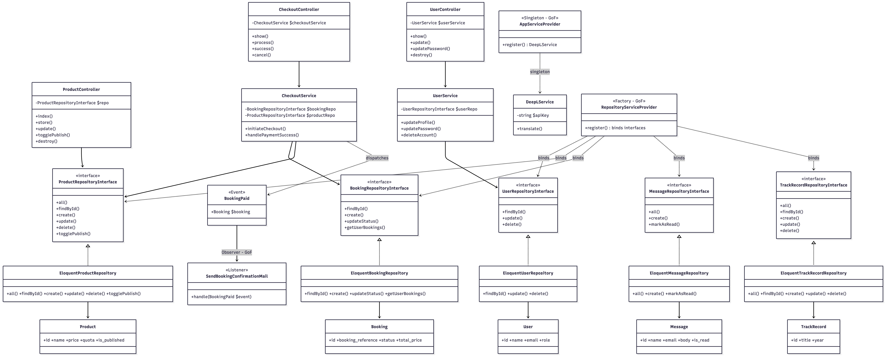
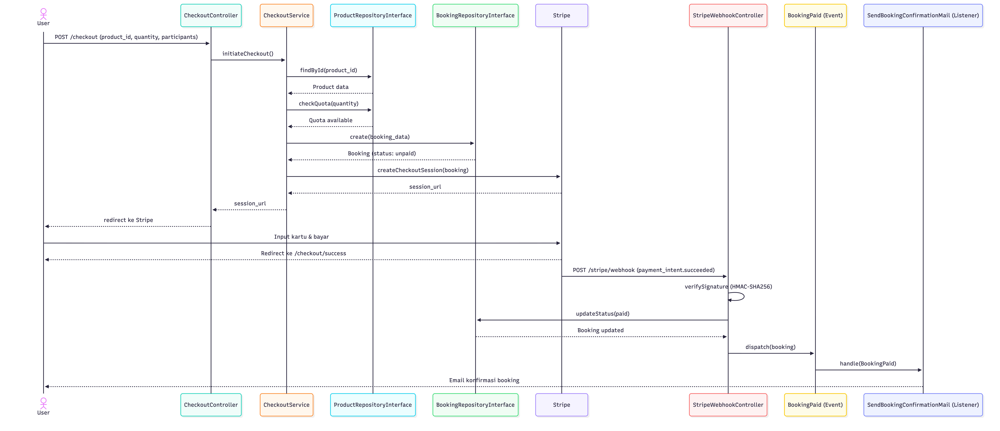

# Mijn Amor Tour and Travel Website

Aplikasi web pemesanan perjalanan wisata yang dibangun sebagai proyek UAS Rekayasa Perangkat Lunak 2025/2026. Sistem ini memungkinkan pengguna untuk melihat katalog produk wisata, melakukan pemesanan, dan pembayaran via Stripe. Admin dapat mengelola produk, track record, booking, dan memantau aktivitas pengguna.

## Fitur Utama

- Registrasi & login pengguna dengan verifikasi email opsional
- Katalog produk wisata dengan galeri gambar (WebP)
- Proses checkout & pembayaran via Stripe
- Konfirmasi booking otomatis via email (Observer Pattern)
- Halaman MyBooking — riwayat & status pesanan
- Track Record — dokumentasi perjalanan sebelumnya
- Multi-bahasa: Indonesia, Inggris, Belanda, Jerman, Portugis (DeepL API)
- Dashboard admin — kelola produk, booking, pesan, dan pengguna

---

## Teknologi

| Kategori | Teknologi |
|---|---|
| Backend | Laravel 13 (PHP 8.3) |
| Frontend | Blade + Alpine.js + Tailwind CSS |
| Database | MySQL |
| Payment | Stripe |
| Terjemahan | DeepL API |
| Image | Intervention Image (WebP) |
| Linter | Laravel Pint |

---

## Cara Menjalankan Secara Lokal

### Prasyarat
- PHP >= 8.3
- Composer
- Node.js & NPM
- MySQL
- Akun Stripe (untuk payment)

### Langkah Instalasi

**1. Clone repository**
```bash
git clone https://github.com/nidioganteng/rpl-project.git
cd rpl-project
```

**2. Install dependencies**
```bash
composer install
npm install
```

**3. Konfigurasi environment**
```bash
cp .env.example .env
php artisan key:generate
```

**4. Edit file `.env` — sesuaikan konfigurasi berikut:**
```env
APP_NAME="Mijn Amor Travel"
APP_URL=http://localhost:8000

DB_CONNECTION=mysql
DB_HOST=127.0.0.1
DB_PORT=3306
DB_DATABASE=mijn_amor
DB_USERNAME=root
DB_PASSWORD=

MAIL_MAILER=smtp
MAIL_HOST=smtp.gmail.com
MAIL_PORT=587
MAIL_USERNAME=your@email.com
MAIL_PASSWORD=your_app_password
MAIL_FROM_ADDRESS=your@email.com
MAIL_FROM_NAME="Mijn Amor Travel"

STRIPE_SECRET=sk_test_xxxx
STRIPE_WEBHOOK_SECRET=whsec_xxxx

# Opsional — jika dikonfigurasi, terjemahan otomatis aktif
DEEPL_API_KEY=your_deepl_api_key
DEEPL_FREE_API=true
```

**5. Migrasi & seed database**
```bash
php artisan migrate --seed
```

**6. Build assets**
```bash
npm run build
```

**7. Jalankan server**
```bash
php artisan serve
```

Aplikasi berjalan di `http://localhost:8000`

**8. (Opsional) Jalankan Stripe webhook listener untuk testing lokal**
```bash
stripe listen --forward-to http://localhost:8000/stripe/webhook
```

### Akun Default (Seeder)

| Role | Email | Password |
|---|---|---|
| Admin | admin@mijnamor.com | password |
| User | user@mijnamor.com | password |

---

## Arsitektur Sistem

Sistem menggunakan **Layered Architecture** dengan pemisahan layer yang ketat:

```
Presentation Layer     →    Business Logic Layer    →    Data Access Layer    →    Database
  (Controller)                   (Service)              (Repository + Model)       (MySQL)
app/Http/Controllers/          app/Services/           app/Repositories/         migrations/
```

**Prinsip:**
- Controller hanya menerima request dan mendelegasikan ke Service atau Repository
- Service mengandung logika bisnis, tidak menyentuh database langsung
- Repository diakses via Interface — implementasi bisa diganti tanpa mengubah layer atas
- Model hanya merepresentasikan struktur tabel

> Penjelasan lengkap arsitektur dan diagram tersedia di [`docs/architecture.md`](docs/architecture.md)

### Class Diagram



### Entity Relationship Diagram (ERD)


### Sequence Diagram — Alur Checkout



---

## Design Patterns (GoF)

### 1. Observer Pattern — `Behavioral`

Digunakan untuk mengirim email konfirmasi booking secara otomatis setelah pembayaran Stripe berhasil, tanpa controller perlu mengetahui siapa yang bereaksi.

| File | Keterangan |
|---|---|
| `app/Events/BookingPaid.php` | Event yang di-dispatch setelah payment sukses |
| `app/Listeners/SendBookingConfirmationMail.php` | Listener — kirim email konfirmasi ke user |
| `app/Providers/AppServiceProvider.php` | Registrasi event-listener |

### 2. Singleton Pattern — `Creational`

Digunakan agar `DeepLService` hanya diinstansiasi sekali per request lifecycle, menghindari pembuatan koneksi API yang berulang dan boros.

| File | Keterangan |
|---|---|
| `app/Services/DeepLService.php` | Service terjemahan otomatis via DeepL API |
| `app/Providers/AppServiceProvider.php` | Registrasi singleton di Laravel container |

### 3. Factory Pattern — `Creational`

Digunakan agar Controller dan Service tidak bergantung pada implementasi konkrit Repository. `RepositoryServiceProvider` bertindak sebagai factory yang menentukan binding interface ke implementasi.

| File | Keterangan |
|---|---|
| `app/Repositories/Contracts/*RepositoryInterface.php` | Interface (kontrak abstrak) repository |
| `app/Repositories/Eloquent/Eloquent*Repository.php` | Implementasi konkrit dengan Eloquent |
| `app/Providers/RepositoryServiceProvider.php` | Factory — binding interface ke implementasi |

---

## Kontribusi Anggota Kelompok

| Nama | NIM | Peran | Fitur yang Dikerjakan | Video |
|---|---|---|---|---|
| Benedito Nidio Da Rosa Maia Tilman | 42430032 | Repository Layer (User & Checkout), Observer Pattern | `EloquentUserRepository`, `EloquentBookingRepository`, `UserService`, `CheckoutService`, `BookingPaid` Event & Listener | [Link Video](#) |
| Renald Kevin Azzaky | 42430029 | Repository Layer (Booking Admin), Singleton Pattern, README & Docs | `EloquentBookingRepository` (Admin), `DeepLService` Singleton, `README.md`, `docs/` | [Link Video](#) |
| Ni Luh Risma Putri Wirdianthi | 42430001 | Repository Layer (Product & TrackRecord), Factory Pattern | `EloquentProductRepository`, `EloquentTrackRecordRepository`, `RepositoryServiceProvider` | [Link Video](#) |
| Salsabila Nur Shafa | 42430040 | Repository Layer (Message), Linter Setup | `EloquentMessageRepository`, `pint.json`, code style enforcement | [Link Video](#) |

---

## Dokumentasi

| Dokumen | Lokasi |
|---|---|
| Arsitektur & Design Patterns | [`docs/architecture.md`](docs/architecture.md) |
| Class Diagram | [`docs/diagrams/class-diagram.png`](docs/diagrams/class-diagram.png) |
| ERD | [`docs/diagrams/erd.png`](docs/diagrams/erd.png) |
| Sequence Diagram (Checkout) | [`docs/diagrams/sequence-diagram.png`](docs/diagrams/sequence-diagram.png) |
| Software Requirements Specification | [`Document/REKAYASAN PERANGKAT LUNAK.pdf`](../Document/REKAYASAN%20PERANGKAT%20LUNAK.pdf) |
